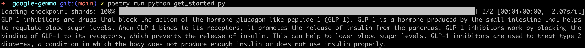

# Getting Started with Gemma 

## Requirements

 1. huggingface-cli [To access the GATED model]
 2. (Option 1) pip install 
    1. 'huggingface_hub[cli]'
    1. transformers
    2. torch
 3. (option 2) Using poetry
    1. poetry install

## Running the code

  1. Log in to huggingface cli
  2. Open the `get_started.py` script
     - set device appropriately
  3. Run the `python get_started.py` script or 
      `poetry run python get_started.py`

Output:
